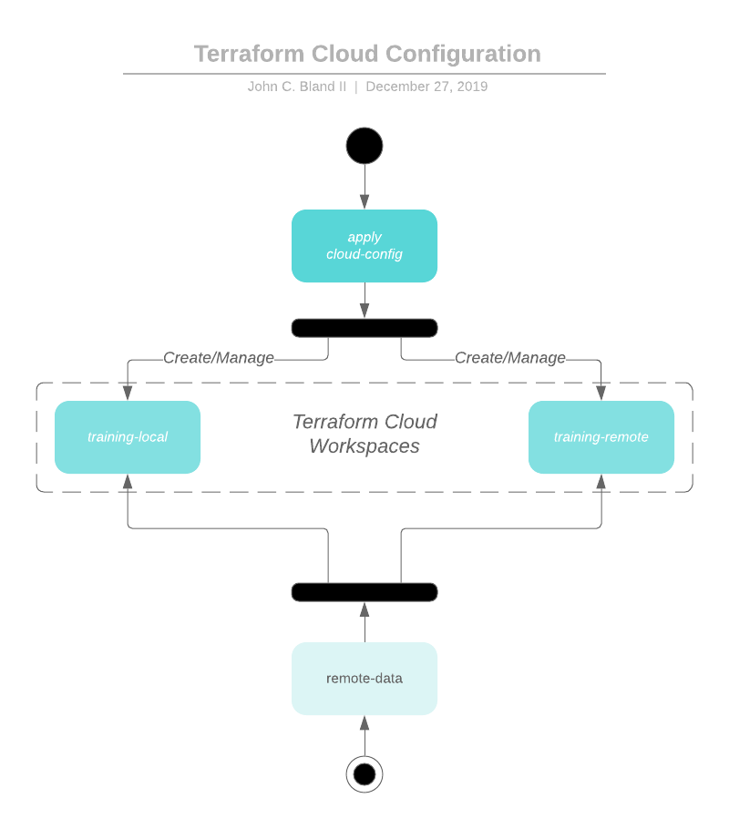

# Terraforming with Terraform Cloud Tutorial

[Terraform Cloud](https://app.terraform.io) (TFC) is a great place to either be your full Terraform CI or simply manage your state. The beautiful part of TFC is the ability to use Terraform to fully manage it.

## Terraforming Workspaces

TFC uses the concept of [workspaces](https://www.terraform.io/docs/glossary.html#workspace). This means you can utilize Terraform to manage multiple instances of the same workspace specific to a stage (e.g. dev, qa, prod, etc). This works flawlessly with the [Terraform CLI's `workspace` commands](https://www.terraform.io/docs/commands/workspace/index.html). This tutorial will not dig into those fully, but it is important to know they exist.



### Workspace Generation

The [cloud-config](cloud-config/README.md) folder has the Terraform necessary to manage your TFC account. It is a basic configuration used to generate two workspaces.

### Project Integration

The [project](project/README.md) folder simulates how a specific project could utilize the aforementioned workspaces to use TFC as a CI or as a state manager.

### Remote Data

The [remote-data](remote-data/README.md) folder shows how to use the state saved in the TFC workspace applied from the [project](project/) code.

## Usage

This project is not intended to be used as a module for remote use. Take the files, customize them, and use them to your hearts content. Create an issue if you have questions.

The [Makefile](Makefile) has general commands to use for ease of development. There aren't special by any means. Feel free to `cd` to directories and run the `terraform` CLI commands you know and love directly.

### `make` commands

```make
Available targets:
config-apply                   TF Apply the cloud-config directory
config-plan                    TF Plan the cloud-config directory
fmt                            Formats the TF
init                           Install required tools for local environment
project-apply                  TF Apply the project directory
project-local                  Sets the `project` directory workspace to `local`
project-plan                   TF Plan the project-local directory
project-remote                 Sets the `project` directory workspace to `remote`
remote-data-apply              TF Apply the remote-data directory
remote-data-plan               TF Plan the remote-data directory
```

## Trademarks

All other trademarks referenced herein are the property of their respective owners.

## About

This tutorial is maintained and funded by [Katapult Media, Inc](https://katapultmedia.com). Send us a message!


